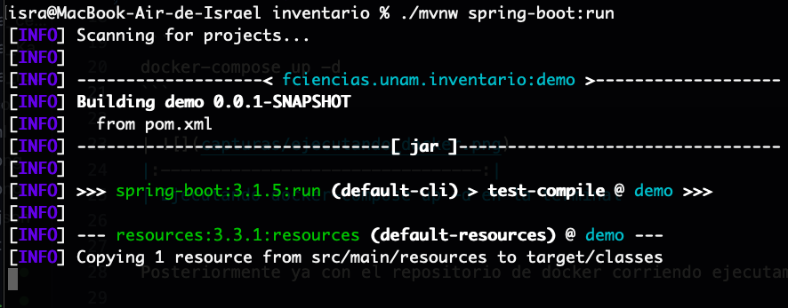
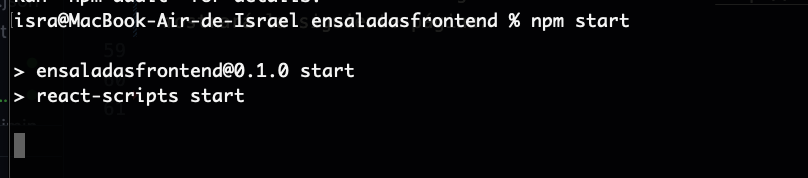

# Proyecto - Implementación de FRONT en REACT [ensaladas]
- Israel Hernández Dorantes - 318206604

## Descripción del Proyecto:

El proyecto consiste en una aplicacion web que corre una pagina de Ensaladas que esta conectada a una base de datos, en la que es posible checar ensaladas, sus recetas y hay un inventario donde estan los ingredientes para las ensaladas en donde es posible eliminar, agregar y editar ingrediente.

Es realizada en React (Frontend) y en Spring (Backend).

## Requisitos:
- Tener Docker instalado
- Tener NodeJS instalado

## Como ejecutar el Proyecto:

Para ejecutar el proyecto primero se debe mover a la carpeta del proyecto, y a la carpeta inventario dentro de este.
Luego ejecutamos lo siguiente:

```
docker-compose up -d
```

| 
|:--------------------------------:|
| Ejecutando docker-compose up -d en la terminal


Posteriormente ya con el repositorio de docker corriendo ejecutamos:

```
./mvnw spring-boot:run
```

| 
|:--------------------------------:|
| Ejecutando la aplicacion (backend)


Donde si todo salio bien la aplicación estará corriendo en el puerto 8080.

| 
|:--------------------------------:|
| Aplicacion corriendo (backend)


Después ejecutamos la aplicación en React, para ello, primero nos movemos a la carpeta de "ensaladasfrontend", e instalamos los paquetes con el siguiente comando:
```
npm install
```

| 
|:--------------------------------:|
| Instalando paquetes


Luego, iniciamos la aplicación con el siguiente comando:
```
npm start
```

| 
|:--------------------------------:|
| Ejecutando aplicación (Front)


| 
|:--------------------------------:|
| Aplicación corriendo (Front)


Lo cual nos abrirá el navegador en la dirección "http://localhost:3000/" y nos mostrará la siguiente página:

| 
|:--------------------------------:|
| Página en el navegador
